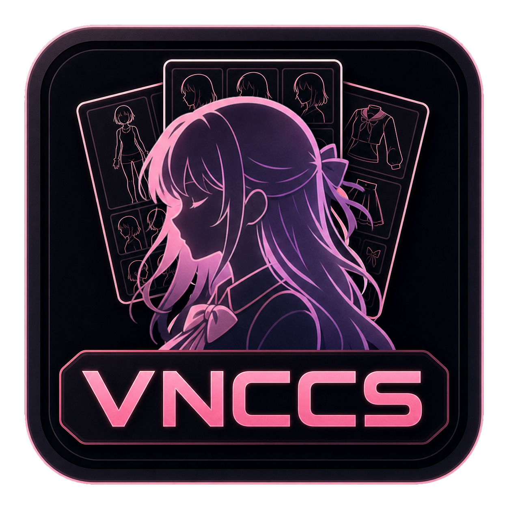

<p align="center">
<strong>English</strong> |
<a href="docs/README.ru.md#ru">Русский</a> |
<a href="docs/README.zh-CN.md#vnccs-easy-install">简体中文</a> |
<a href="docs/README.ja.md#vnccs-easy-install">日本語</a> |
<a href="docs/README.ko.md#vnccs-easy-install">한국어</a> |
<a href="docs/README.es.md#vnccs-easy-install">Español</a> |
<a href="docs/README.pt-BR.md#vnccs-easy-install">Português</a> |
<a href="docs/README.de.md#vnccs-easy-install">Deutsch</a> |
<a href="docs/README.fr.md#vnccs-easy-install">Français</a> |
<a href="docs/README.tr.md#vnccs-easy-install">Türkçe</a> |
<a href="docs/README.vi.md#vnccs-easy-install">Tiếng Việt</a>
</p>

---

<p align="center">
  
</p>


<div align="center">

# VNCCS Easy Install

Portable Windows installer for **VNCCS - Visual Novel Character Creation Suite** on **ComfyUI**.

[VNCCS GitHub](https://github.com/AHEKOT/ComfyUI_VNCCS) |
[VNCCS Utils GitHub](https://github.com/AHEKOT/ComfyUI_VNCCS_Utils) |
[Discord](https://discord.com/invite/9Dacp4wvQw) |
[Buy Me a Coffee](https://www.buymeacoffee.com/MIUProject)

</div>

## What This Is

VNCCS Easy Install is a ready-to-run ComfyUI package focused on one job: getting you into the VNCCS character production pipeline with as little setup friction as possible.

VNCCS is not just another workflow for creating a single consistent image. It is a full visual novel character creation system: create a character, clone an existing character, design clothing, generate emotion sets, manage poses, produce sprites, and keep the results organized in a reusable character library.

This fork keeps the useful portable Windows foundation of ComfyUI-Easy-Install, but the default installed nodes, documentation, and entrypoint are tuned for VNCCS.

## Why VNCCS

- A complete character pipeline instead of scattered one-off workflows.
- Consistent character generation across base sheets, outfits, emotions, poses, and final sprites.
- VNCCS Control Center for downloading and selecting the required Qwen Image Edit 2511 models, LoRAs, VAE, text encoder, and upscaler files.
- VNCCS Pose Studio: an interactive 3D posing, framing, lighting, and pose-library environment directly inside ComfyUI.
- Character Cloner for building a VNCCS character from existing reference images.
- Clothes Designer for creating and cloning outfits while keeping character identity.
- Emotion Studio for producing sprite-ready emotion variations.
- Model Manager and Selector utilities for managing LoRAs and checkpoints from HuggingFace or Civitai-backed repositories.

VNCCS saves characters under:

```text
ComfyUI/output/VNCCS/Characters/YOUR_CHARACTER_NAME
```

Back this folder up regularly. It is your character library.

## Included Core Components

| Component | Purpose |
|---|---|
| [ComfyUI](https://github.com/Comfy-Org/ComfyUI) | The node-based generation environment |
| [ComfyUI Manager](https://github.com/Comfy-Org/ComfyUI-Manager) | Node management and update support |
| Embedded Python 3.12.10 | Portable Python runtime |
| Git | Repository installation and updates |
| EZi Desktop helper | Launching, updating, folder shortcuts, and installer tools |

## Installed VNCCS Nodes

| Node package | Why it is included |
|---|---|
| [ComfyUI_VNCCS](https://github.com/AHEKOT/ComfyUI_VNCCS) installed as `vnccs` | Main Visual Novel Character Creation Suite |
| [ComfyUI_VNCCS_Utils](https://github.com/AHEKOT/ComfyUI_VNCCS_Utils) installed as `vnccs-utils` | Pose Studio, Visual Camera Control, QWEN Detailer, Model Manager, Model Selector |
| [ComfyUI-GGUF](https://github.com/city96/ComfyUI-GGUF) | Required by VNCCS Control Center for GGUF Qwen model loading |
| [ComfyUI-Impact-Pack](https://github.com/ltdrdata/ComfyUI-Impact-Pack) | Required for detector, SAM, and FaceDetailer paths used by VNCCS |
| [ComfyUI-SeedVR2_VideoUpscaler](https://github.com/numz/ComfyUI-SeedVR2_VideoUpscaler) | Used by the default VNCCS upscaler mode |
| [ComfyUI-Easy-Sam3](https://github.com/yolain/ComfyUI-Easy-Sam3) | Used by clone-clothes preprocessing |
| [quick-connections](https://github.com/niknah/quick-connections) | Convenience UI extension requested for this build |

The old broad Easy Install / Pixaroma tutorial node pack is intentionally not installed by default. This build keeps the node set focused on what VNCCS needs.

## VNCCS Workflow Entry Points

Open the VNCCS workflows in ComfyUI after installation:

1. `VNCCS_3.0_Step1_CharacterCreator.json` - create a base character.
2. `VNCCS_3.0_Step1_CharacterCloner.json` - clone a character from one or more references.
3. `VNCCS_3.0_Step2_CharacterClothes.json` - create or clone outfits.
4. `VNCCS_3.0_Step3_CharacterEmotions.json` - generate emotion sprites.
5. `VNCCS_MigrationAssistent.json` - migrate characters from older VNCCS versions.

The practical flow is:

```text
Create or clone character -> Generate clothes -> Generate emotions -> Use sprites in your visual novel
```

## Models

VNCCS 3.0 uses **VNCCS Control Center**. Open a VNCCS workflow and use **Download ALL** to place the main models into the correct ComfyUI folders.

The default generation path is Qwen Image Edit 2511 with GGUF model loading. Control Center currently manages:

- Qwen Image Edit 2511 GGUF models: Q4, Q5, Q8.
- QIE2511 text encoder and VAE.
- Qwen Image Edit 2511 Lightning LoRA.
- VNCCS Clothes Core LoRA.
- VNCCS Emotion Core LoRA.
- VNCCS Pose Studio LoRA.
- 4x APISR upscaler.

Character Cloner and the clothing wizard can also use Qwen2.5-VL helper GGUF files for image description. Their UI has dedicated download controls.

## Windows Installation

1. Download or extract this VNCCS Easy Install package into a new folder.
2. Run `ComfyUI-Easy-Install.bat`.
3. Do not run the installer as Administrator.
4. Avoid system folders such as `Program Files`, `Windows`, or the root of `C:\`.
5. Avoid spaces and special characters in the install path.
6. Keep NVIDIA drivers up to date.

After setup, launch ComfyUI with `Start ComfyUI.bat` or use the EZi Desktop launcher.

## Useful Add-ons

The package still contains selected Easy Install helper tools:

- Easy-Models-Linker for using an existing models folder via `extra_model_paths.yaml`.
- Easy-System-Checker for hardware and software checks.
- ComfyUI-Version-Switcher for rollback testing.
- Easy-model2GGUF for model conversion and quantization.
- Long-Paths-Enabler for Windows long path support.
- Torch-Pack for switching supported PyTorch/CUDA builds.
- Update Easy-Install for refreshing helper files.

Optional experimental add-ons such as Nunchaku, SageAttention, FlashAttention, InsightFace, and Trellis are still credited as inherited installer tooling, but they are not the default VNCCS path.

## Community And Support

Join the VNCCS community:

[](https://discord.com/invite/9Dacp4wvQw)

Support VNCCS development:

[](https://www.buymeacoffee.com/MIUProject)

VNCCS is maintained as an independent project. Support helps keep the character pipeline, Pose Studio, model tooling, and documentation moving forward.

## VNCCS Repositories

- Main node: [AHEKOT/ComfyUI_VNCCS](https://github.com/AHEKOT/ComfyUI_VNCCS)
- Utility nodes: [AHEKOT/ComfyUI_VNCCS_Utils](https://github.com/AHEKOT/ComfyUI_VNCCS_Utils)

## Credits To The Installer Foundation

This project is based on **ComfyUI-Easy-Install** by **Tavris1 / ivo**. The original installer work made the portable Windows ComfyUI foundation, EZi Desktop helper, update scripts, add-on tools, and dependency-management flow possible.

Original installer:

- Repository: [Tavris1/ComfyUI-Easy-Install](https://github.com/Tavris1/ComfyUI-Easy-Install)
- Releases: [ComfyUI-Easy-Install releases](https://github.com/Tavris1/ComfyUI-Easy-Install/releases)
- macOS / Linux branch: [MAC-Linux](https://github.com/Tavris1/ComfyUI-Easy-Install/tree/MAC-Linux)

Support the original installer creator:

[](https://paypal.me/tavris1)
[](https://buymeacoffee.com/tavris1)
[](https://github.com/sponsors/Tavris1)
